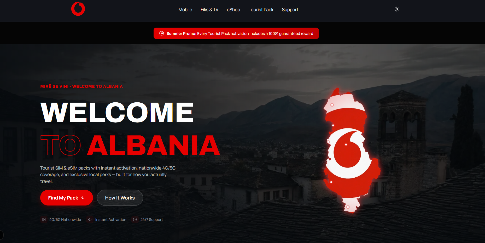
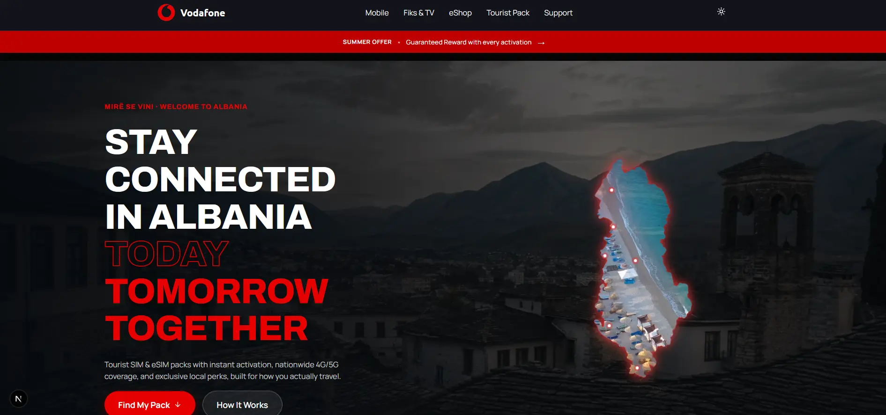
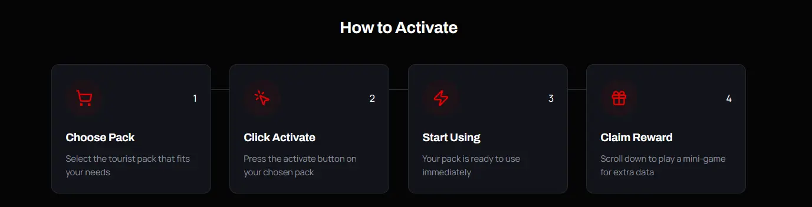
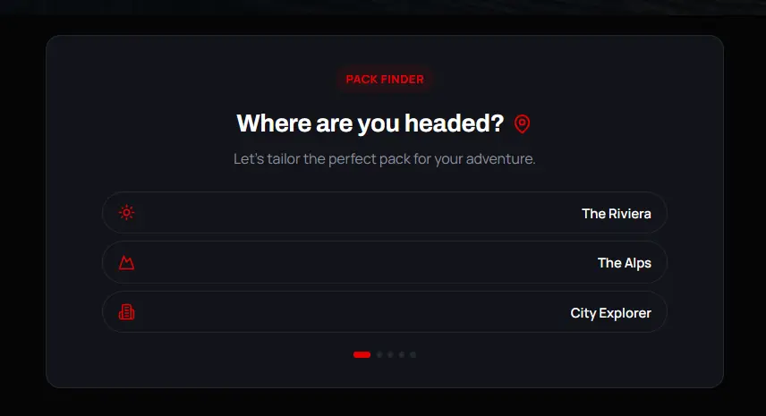
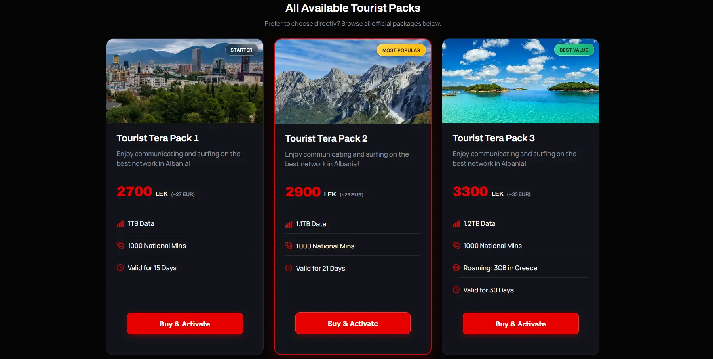
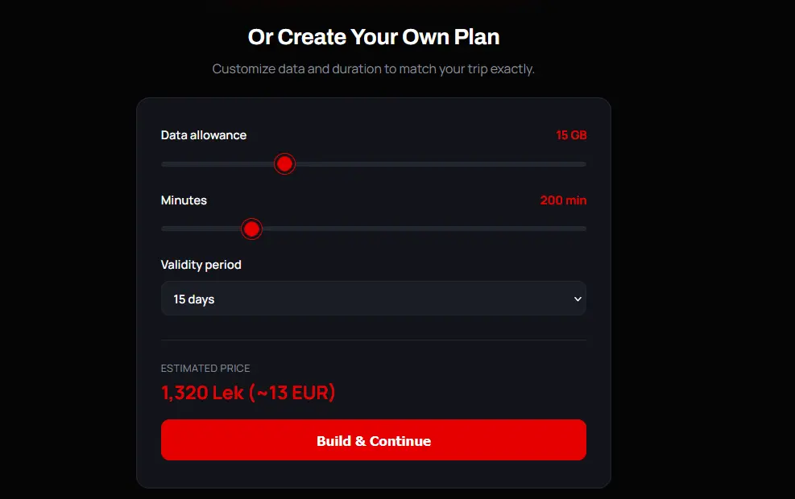
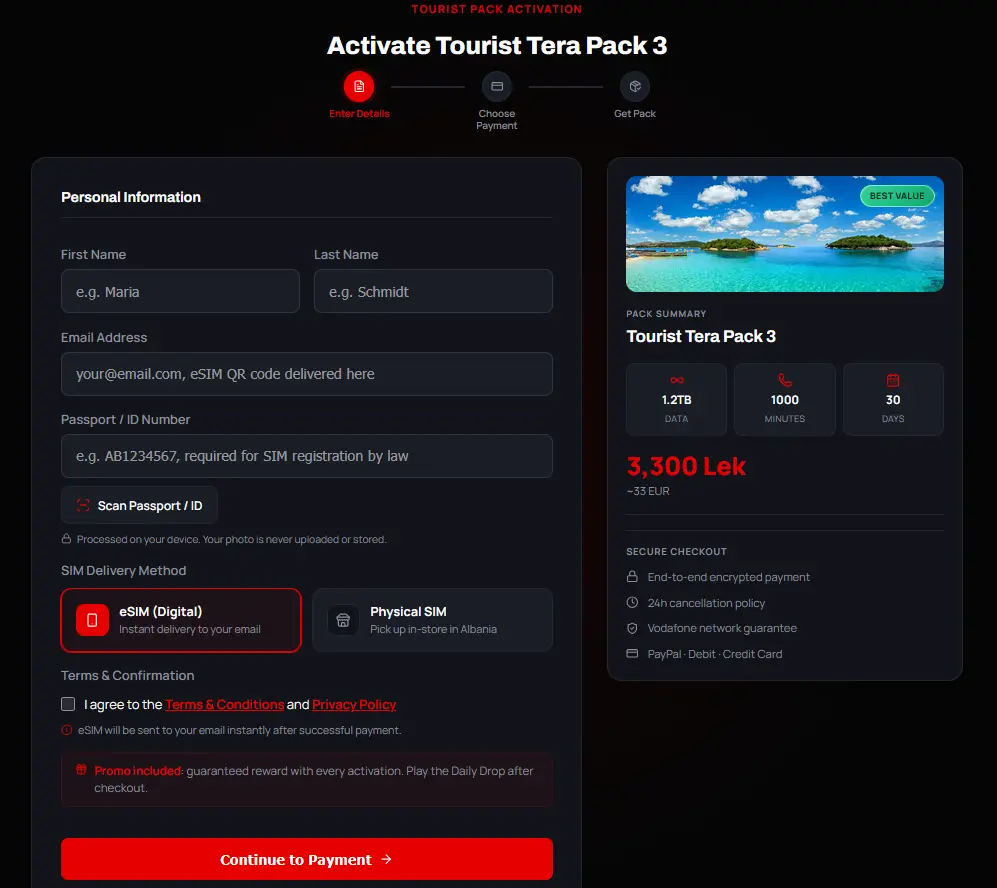
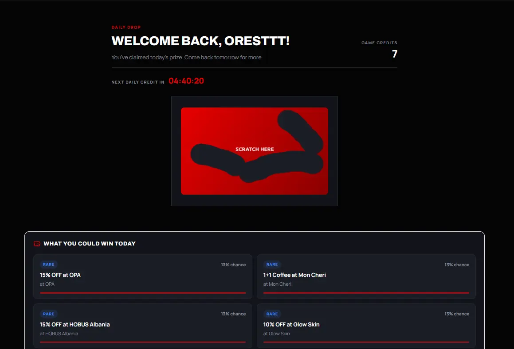
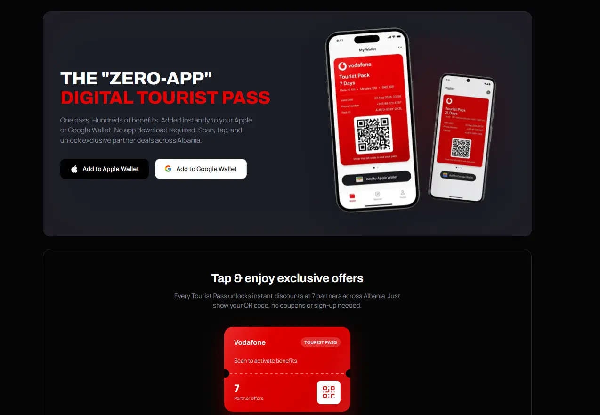

# Vodafone Tourist Pack — Frontend



Next.js app for the tourist eSIM/data pack flow: find or build a pack, activate it (optionally
auto-filling your passport/ID via an on-device camera scan), pay through PayPal, add a Vodafone
Tourist Pass to Apple/Google Wallet, and land in a Game Hub where a daily scratch card can win a
real discount on your next pack.

Talks to a separate Spring Boot backend over REST. This repo doesn't run without it.

## Stack

- Next.js 15, App Router, Turbopack
- TypeScript
- Plain CSS (`app/styles.css`), theming via CSS custom properties and `[data-theme='dark']` — no Tailwind, no CSS modules
- Framer Motion for the scratch card / reveal animations
- Lucide for icons
- `tesseract.js` + `mrz` for 100% client-side passport/ID OCR (see below)
- PayPal JS SDK, proxied through a few Next API routes so the client secret never reaches the browser

## Structure

```
app/                       routes: /, /activate, /payment, /game-hub, /my-pack,
                            /terms, /privacy, /wallet/{apple,google}/[id],
                            plus the PayPal API routes
features/
  activation/               pack selection, custom plan builder, checkout stepper,
                             passport/ID scanner, PayPal, tourist details form
  game-hub/                 daily drop, scratch card, reward reveal, prize catalog
  my-pack/                  subscription-status lookup + wallet button
  marketing/                landing page offer sections
  stores/                   store locator map pins + data
shared/                     header, footer, theme toggle, shared icons/utils
```

Each feature owns its own `lib/api.ts` and talks to the backend directly — there's no shared API client.

## Running locally

```
npm install
npm run dev
```

Needs the backend running on `localhost:8080` (or wherever `NEXT_PUBLIC_API_BASE_URL` points).

### Testing on a phone (same Wi-Fi as your dev machine)

Next.js's dev server blocks `/_next/*` asset requests from origins not listed in
`allowedDevOrigins` (`next.config.ts`) — add your machine's current LAN IP there if it's changed.
You'll also need `NEXT_PUBLIC_API_BASE_URL` pointed at that same LAN IP (not `localhost`) and the
backend's `APP_CORS_ALLOWED_ORIGIN` to include it too. The live passport-camera view additionally
needs a secure context (HTTPS, or exactly `localhost`) — it isn't available over plain
`http://<lan-ip>`, and falls back automatically to the file-picker capture flow when it isn't.

## Environment variables

| Variable | Used by | Notes |
|---|---|---|
| `NEXT_PUBLIC_API_BASE_URL` | every feature's `lib/api.ts`, PayPal API routes | Defaults to `http://localhost:8080/api/v1` if unset |
| `NEXT_PUBLIC_PAYPAL_CLIENT_ID` | `features/activation/lib/paypal.ts` | Public, safe to expose |
| `PAYPAL_CLIENT_SECRET` | PayPal API routes (server-side only) | Do not prefix with `NEXT_PUBLIC_` |
| `PAYPAL_MODE` | PayPal API routes | `sandbox` or `live`, defaults to `sandbox` |

## Flow, roughly

1. `/` → pick a fixed pack, or build a custom one (live-priced data/minutes/duration sliders) → `/activate`
2. `/activate` collects tourist details — optionally auto-filled by scanning a passport/ID
   entirely on-device — and redirects to `/payment` with the order/pack IDs
3. `/payment` handles the PayPal capture, calls the backend to activate the pack, then redirects
   to `/game-hub?touristId=...`
4. `/game-hub` reads `touristId` from the query string and mounts `GameProvider`, which drives
   credit balance, daily claim, and the scratch card end to end
5. `/my-pack?touristId=...` — pack details, key dates, and the "Add to Apple Wallet" button; also
   linked from the confirmation email and the Daily Drop reward screen

## Walkthrough

### 1. Landing page (`/`)

The hero pitches the pack, then two ways into checkout: a short "Pack Finder" quiz (trip type →
recommended pack) or the grid of fixed packs below it. A "How to Activate" strip explains the
whole flow in four steps before the tourist commits to anything.




**Pack Finder** (`features/marketing`) — three quick questions narrow the fixed-pack grid down to
one recommendation:



**Fixed packs** — the same three packs the backend serves from `GET /api/v1/packs`, each a
`Buy & Activate` button away from `/activate`:



**Custom plan builder** (`features/activation`, `custom/build` + `custom/quote` endpoints) — data,
minutes, and validity sliders re-price live against the backend on every drag, no page reload:



### 2. Activation (`/activate`)

Personal info on the left (with the optional on-device passport/ID scan — see below), a live
summary of the chosen pack and its price on the right. Nothing here calls the backend yet; it all
gets handed to `/payment` via `sessionStorage`.



### 3. Payment → Game Hub

PayPal capture happens on `/payment`, then the tourist lands on `/game-hub`, where the Daily Drop
scratch card is playable once per day (Europe/Tirane, enforced by the backend, not the client):



### 4. My Pack & the digital Tourist Pass

`/my-pack?touristId=...` — linked from the confirmation email and from the Daily Drop screen — is
where the tourist adds the Vodafone Tourist Pass to Apple/Google Wallet. The pass itself is a
QR-coded ticket, generated server-side by PassKit, that unlocks discounts at partner businesses
around Albania with no extra app or sign-up:



The `touristId` is passed around as a plain query param, not stored in a cookie or session — it's
an unguessable UUID, not a sequential ID, but a leaked link grants full access with no
re-authentication. Reasonable for a low-stakes, no-login tourist flow; worth hardening (short-lived
signed tokens, email re-verification) before this ever handles anything higher-stakes.

## Passport/ID scanning — privacy design

The optional "Scan Passport / ID" button never uploads the photo anywhere:

- OCR (`tesseract.js`) and MRZ parsing (`mrz`) run entirely in the browser.
- Only the passport's Machine Readable Zone is read — the same standardized strip every airport
  e-gate reads — not the printed page or photo.
- Only three fields are ever extracted: first name, last name, document number. Everything else
  the MRZ encodes (DOB, sex, nationality, expiry) is read but discarded immediately.
- The photo, the canvas, and the full OCR text are all dropped the instant scanning finishes —
  nothing is written to any storage, client or server.
- A live camera view with an on-screen alignment guide is used when available (secure context
  required); otherwise it falls back to a native file/camera picker with a static framing guide.

## Known rough edges

- `next.config.ts`'s `allowedDevOrigins` needs manual updating if your LAN IP changes.
- PassKit's free/draft tier caps total passes issued and expires each one after 48 hours — fine
  for a demo, not for anything beyond it.
- Game Hub state isn't polled or revalidated on window focus, so if a tourist claims their credit
  on another tab/device it won't show up here until the next manual action triggers a refetch.
